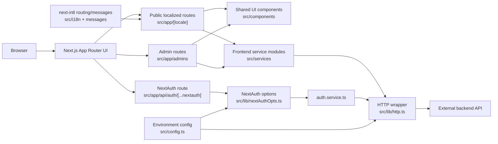
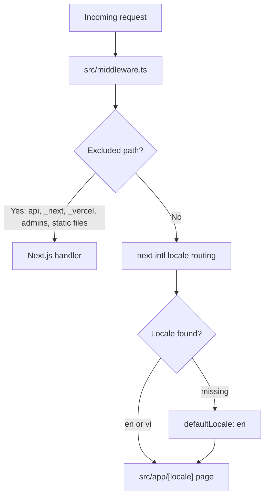
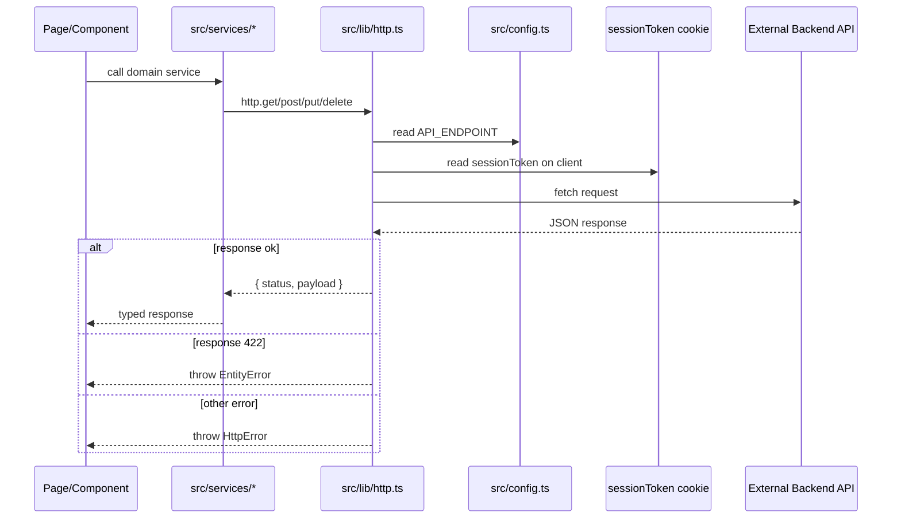
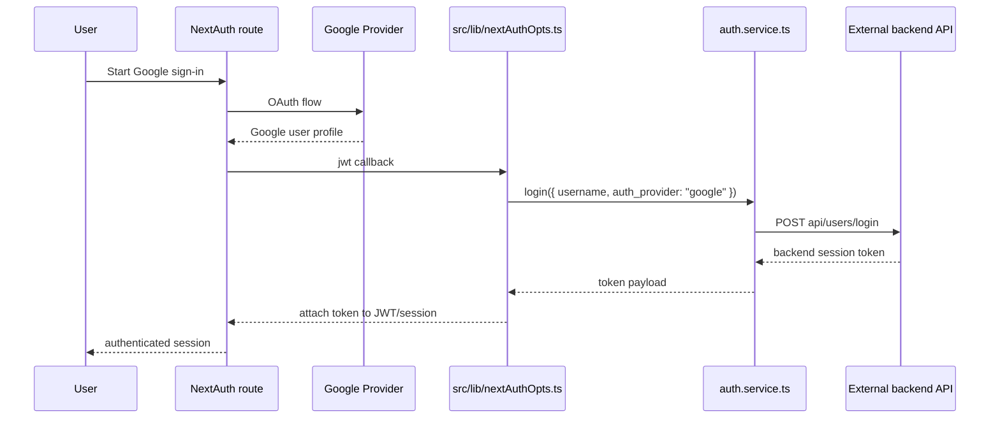
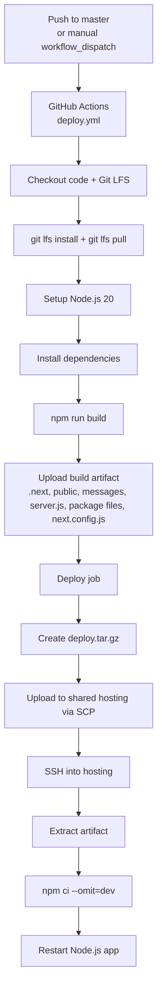

# Architecture

## Overview

This repository is a frontend/client application built with Next.js App Router, TypeScript, `next-intl`, and `next-auth`.

It does not contain the backend implementation or database layer. Backend data is consumed through external API endpoints via service modules in `src/services/`.

## Architecture Summary



Summary flow:

```txt
Browser
  -> Next.js App Router UI
  -> frontend service modules in src/services/
  -> shared HTTP wrapper in src/lib/http.ts
  -> external backend API
```

## Main Responsibilities

| Layer                | Location                                                             | Responsibility                                                                                                                       |
| -------------------- | -------------------------------------------------------------------- | ------------------------------------------------------------------------------------------------------------------------------------ |
| Routing and pages    | `src/app/`                                                           | Defines public pages, admin pages, layouts, loading states, error boundaries, metadata routes, and the local NextAuth route handler. |
| Shared UI            | `src/components/`                                                    | Reusable components, UI primitives, partials, cards, forms, renderers, and shared presentation components.                           |
| Feature/page UI      | `src/app/[locale]/**`, `src/app/admins/**`                           | Page-specific views and components for public website sections and admin workflows.                                                  |
| API integration      | `src/services/`                                                      | Frontend service modules that call external backend endpoints.                                                                       |
| HTTP behavior        | `src/lib/http.ts`                                                    | Shared fetch wrapper, base URL resolution, JSON/FormData handling, auth header injection, and HTTP error classes.                    |
| Auth integration     | `src/lib/nextAuthOpts.ts`, `src/app/api/auth/[...nextauth]/route.ts` | NextAuth Google provider setup, JWT session handling, and backend login integration.                                                 |
| Internationalization | `src/i18n/`, `messages/`, `src/middleware.ts`                        | Locale routing, request message loading, and middleware for localized public routes.                                                 |
| Validation/types     | `src/schemaValidations/`, `src/types/`                               | Zod schemas and TypeScript types used by the frontend.                                                                               |
| Styling/assets       | `src/assets/`, `public/`, `src/app/style.css`                        | SCSS, plugin CSS, public images, static JS, fonts, PDFs, and global styles.                                                          |
| Runtime config       | `src/config.ts`, `.env`                                              | Validates and exposes environment configuration used by the frontend. Do not copy real `.env` values into documentation.             |

## Routing Architecture

The app uses the Next.js App Router.

### Root App Files

Important root app files:

- `src/app/layout.tsx`
- `src/app/loading.tsx`
- `src/app/error.tsx`
- `src/app/robots.ts`
- `src/app/sitemap.ts`
- `src/app/style.css`
- `src/app/fontDeclare.ts`

### Public Localized Routes

Public pages are grouped under:

- `src/app/[locale]/`

Supported locales are configured in:

- `src/i18n/routing.ts`

Current locales:

- `en`
- `vi`

The default locale is:

- `en`

Major localized route groups include:

- `src/app/[locale]/(mainpage)/`
- `src/app/[locale]/(center&lab)/`
- `src/app/[locale]/auth/`
- `src/app/[locale]/homepage_views/`
- `src/app/[locale]/iscmer/`

### Admin Routes

Admin pages live outside the localized route group:

- `src/app/admins/`

Admin dashboard routes include:

- `src/app/admins/dashboard/(posts)/`
- `src/app/admins/dashboard/(people)/`
- `src/app/admins/dashboard/components/`
- `src/app/admins/dashboard/pending/`

The middleware excludes admin routes from locale middleware matching.

### Local API Route

The repository includes one local Next.js API route:

- `src/app/api/auth/[...nextauth]/route.ts`

This route is for NextAuth only. Other API calls are made to the external backend through `src/services/`.

## Internationalization Flow

Internationalization is handled by `next-intl`.

Relevant files:

- `messages/en.json`
- `messages/vi.json`
- `src/i18n/routing.ts`
- `src/i18n/request.ts`
- `src/middleware.ts`

The middleware applies locale handling to public routes and excludes:

- `/api`
- `/_next`
- `/_vercel`
- `/admins`
- paths containing file extensions



## API Integration Flow

Frontend API calls follow this pattern:

```txt
Page or component
  -> service module in src/services/
  -> src/lib/http.ts
  -> external backend API
```



Service modules are grouped by domain:

- `auth.service.ts`
- `competition.service.ts`
- `course.service.ts`
- `member.service.ts`
- `post.service.ts`
- `recruitment.service.ts`
- `research.service.ts`
- `studiolab.service.ts`
- `uploadImage.service.ts`

The HTTP wrapper:

- resolves relative API paths against `NEXT_PUBLIC_API_ENDPOINT`
- serializes JSON request bodies
- sends `FormData` uploads without forcing JSON headers
- reads `sessionToken` from cookies on the client side
- sends the token in the `authorization` header
- throws `HttpError` for failed responses
- throws `EntityError` for `422` validation responses

## Authentication Flow

Authentication is integrated with NextAuth and Google provider.

Relevant files:

- `src/app/api/auth/[...nextauth]/route.ts`
- `src/lib/nextAuthOpts.ts`
- `src/services/auth.service.ts`
- `src/types/next-auth.d.ts`

High-level flow:

```txt
User signs in with Google
  -> NextAuth provider callback
  -> authServices.login(...)
  -> external backend login endpoint
  -> backend token stored in NextAuth JWT/session fields
```



The backend authentication implementation is not in this repository.

## Configuration Flow

Environment variables are validated in:

- `src/config.ts`

The validated config is imported by frontend infrastructure such as:

- `src/lib/http.ts`
- `src/lib/nextAuthOpts.ts`
- mail-related helpers

Important environment groups:

- API endpoint and server settings
- production domain
- email integration settings
- Google Analytics and Google OAuth settings
- NextAuth settings

See `docs/05_ENVIRONMENT.md` for the full variable list.

## UI and Styling Architecture

Reusable UI lives in:

- `src/components/`

Important component areas:

- `src/components/ui/` for reusable UI primitives
- `src/components/partials/` for page layout partials such as header, footer, and page header
- `src/components/ContactForm/` for contact form UI and styling
- top-level component files for shared cards, pagination, post display, markdown rendering, and common UI behavior

Styles and assets are split across:

- `src/app/style.css`
- `src/assets/scss/`
- `src/assets/plugins/`
- `public/`

The project also uses `components.json` to configure local UI aliases and component conventions.

## Data and Validation

The frontend does not own persistent data storage.

Frontend-side data contracts and validation helpers live in:

- `src/schemaValidations/`
- `src/types/`

These files help type and validate frontend usage of API payloads, but they are not database schemas and are not the authoritative backend contract.

## Static Assets

Static assets live in:

- `public/assets/`
- `public/images/`
- `public/js/`

These include images, icons, PDFs, fonts, archives, Bootstrap/jQuery/Popper browser scripts, and move-system scripts.

## Build and Runtime Architecture

Development:

```txt
npm run dev
```

Build:

```txt
npm run build
```

Production start:

```txt
npm run start
```

Production startup uses:

- `server.js`

`server.js` creates a Node HTTP server, prepares the Next.js app, and forwards requests to the Next.js request handler.

## Deployment Architecture

Deployment automation is defined in:

- `.github/workflows/deploy.yml`

The workflow:

1. Runs on pushes to `master` or manual dispatch.
2. Installs dependencies.
3. Builds the Next.js app.
4. Uploads build artifacts.
5. Transfers the app bundle to shared hosting over SCP.
6. Extracts the bundle remotely.
7. Installs production dependencies.
8. Restarts the hosted Node.js app.



The repository also contains Docker-related files, but Docker is not part of the active deployment flow. The current production deployment path is the GitHub Actions shared-hosting workflow described above.

If Docker deployment is reactivated later, validate the Dockerfile and Next.js build output separately before using it for production.

## What This Repository Does Not Contain

This repository does not include:

- backend controllers
- backend business services
- database schema
- database migrations
- ORM models
- backend deployment infrastructure
- authoritative backend API contracts

Those concerns should be documented in the backend repository, external API documentation, or backend deployment documentation.
