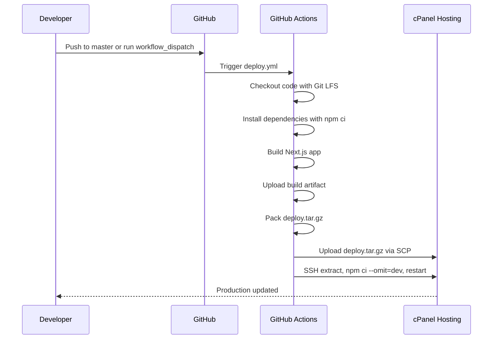

# Deployment Guide

## 1. Overview

This project is deployed to shared hosting/cPanel using GitHub Actions. The active workflow builds the Next.js app in GitHub Actions, packages the production files into a tar archive, uploads the archive with SCP, then uses SSH to extract, install production dependencies, and restart the hosted Node.js app.

Active workflow:

- `.github/workflows/deploy.yml`

This document describes the active shared-hosting deployment flow only. Docker-related files may exist in the repository, but Docker is not part of the active deployment flow.

## 2. Deployment Flow



## 3. Workflow Triggers

The workflow runs when:

- Code is pushed to the `master` branch.
- The workflow is manually triggered with `workflow_dispatch`.

Concurrency is configured with:

- `deploy-iscm-shared-hosting`

In-progress deployments are not cancelled automatically.

## 4. Build Job

The build job runs on:

- `ubuntu-latest`

Node.js version in GitHub Actions:

- `20`

Build steps:

1. Check selected environment secret availability.
2. Check out the repository with Git LFS enabled.
3. Run `git lfs install`.
4. Run `git lfs pull`.
5. Detect package manager.
6. Install dependencies.
7. Run the build command.
8. Upload build artifact.

Because `package-lock.json` exists, the workflow uses npm:

```bash
npm ci
npm run build
```

## 5. Build-Time Environment Variables

The workflow passes these values from GitHub Actions secrets during the build:

- `NEXT_PUBLIC_API_PROTOCOL`
- `NEXT_PUBLIC_SERVER_DOMAIN`
- `NEXT_PUBLIC_SERVER_PORT`
- `NEXT_PUBLIC_API_ENDPOINT`
- `NEXT_PUBLIC_PRODUCTION_DOMAIN`
- `NEXT_PUBLIC_EMAIL_APP_USERNAME`
- `NEXT_PUBLIC_EMAIL_APP_PASS`
- `NEXT_PUBLIC_EMAIL_RECEIVER`
- `NEXT_PUBLIC_GG_ANALYTICS_ID`
- `NEXT_PUBLIC_GG_CLIENT_ID`
- `NEXT_PUBLIC_GG_SCERET`
- `NEXT_PUBLIC_NEXTAUTH_SECRET`

`NEXT_PUBLIC_GG_SCERET` is intentionally documented with the current spelling used by the code and workflow.

## 6. Build Artifact

The workflow uploads this artifact:

- `.next`
- `public`
- `messages`
- `server.js`
- `package.json`
- `package-lock.json`
- `next.config.js`

Artifact name:

- `nextjs-build`

Retention:

- `1` day

## 7. Deploy Job

The deploy job runs after the build job succeeds.

Deploy steps:

1. Download the `nextjs-build` artifact.
2. Check the downloaded artifact.
3. Create `deploy.tar.gz`.
4. Upload `deploy.tar.gz` to shared hosting with `appleboy/scp-action`.
5. SSH into the hosting server with `appleboy/ssh-action`.
6. Source the configured Node path.
7. Change directory to the application path.
8. Remove old deployed files.
9. Extract `deploy.tar.gz`.
10. Delete `deploy.tar.gz`.
11. Install production dependencies.
12. Stop matching Node.js app processes.
13. Touch `tmp/restart.txt` to restart the app.

Remote cleanup performed by the workflow:

```bash
rm -rf .next public messages
rm -f server.js package.json package-lock.json next.config.js
```

Remote extraction and dependency install:

```bash
tar -xzf deploy.tar.gz
rm -f deploy.tar.gz
npm ci --omit=dev
```

Remote restart commands:

```bash
pkill -f "[l]snode:${APP_PATH}" || true
mkdir -p tmp
touch tmp/restart.txt
```

In the actual workflow, `APP_PATH` is provided through `${{ secrets.APP_PATH }}`.

## 8. Required GitHub Secrets

### Application Build Secrets

| Secret | Description |
|---|---|
| `NEXT_PUBLIC_API_PROTOCOL` | API protocol used at build time |
| `NEXT_PUBLIC_SERVER_DOMAIN` | Backend/server domain |
| `NEXT_PUBLIC_SERVER_PORT` | Backend/server port |
| `NEXT_PUBLIC_API_ENDPOINT` | External backend API endpoint |
| `NEXT_PUBLIC_PRODUCTION_DOMAIN` | Production domain value used by the app |
| `NEXT_PUBLIC_EMAIL_APP_USERNAME` | Email integration username |
| `NEXT_PUBLIC_EMAIL_APP_PASS` | Email integration password/app password |
| `NEXT_PUBLIC_EMAIL_RECEIVER` | Email recipient |
| `NEXT_PUBLIC_GG_ANALYTICS_ID` | Google Analytics ID |
| `NEXT_PUBLIC_GG_CLIENT_ID` | Google OAuth client ID |
| `NEXT_PUBLIC_GG_SCERET` | Google OAuth client secret using the current env name |
| `NEXT_PUBLIC_NEXTAUTH_SECRET` | NextAuth secret value used by current code |

### Deployment Secrets

| Secret | Description |
|---|---|
| `SSH_HOST` | Hosting server address |
| `SSH_PORT` | SSH port |
| `SSH_USER` | SSH username |
| `SSH_KEY` | Private SSH key used by the SCP/SSH actions |
| `APP_PATH` | Absolute path to the app on hosting |
| `NODE_PATH` | Shell snippet/path sourced before remote commands to load Node.js |

## 9. Runtime

Production startup uses:

```bash
npm run start
```

The `start` script runs:

```bash
NODE_ENV=production node server.js
```

`server.js` starts a custom Node HTTP server and uses:

```js
process.env.PORT || 3000
```

## 10. cPanel Setup Checklist

- Node.js app is created in cPanel.
- Node.js version is compatible with the build output and dependencies.
- App root points to the deployment directory represented by `APP_PATH`.
- Startup file is configured as `server.js`.
- Runtime environment variables are configured on hosting when required.
- Domain points to the correct app.
- SSL certificate is active.
- SSH access is enabled.
- GitHub Actions SSH key is authorized.
- Node path setup is represented by `NODE_PATH`.

## 11. cPanel `node_modules` Symlink Warning

The shared hosting/cPanel environment may manage `node_modules` through a Node.js Selector virtual environment or symlink.

This repository's active workflow currently runs:

```bash
npm ci --omit=dev
```

on the remote host after extracting the artifact. Before changing dependency install behavior, confirm how the hosting environment manages `node_modules`. If cPanel owns `node_modules` as a symlink, overwriting it can break the hosted Node.js app. Treat dependency installation on the server as a hosting-sensitive operation.

## 12. Pre-Deployment Checklist

- Code is pushed to the `master` branch or the workflow is manually dispatched.
- `npm run build` succeeds locally or in CI.
- GitHub Actions application build secrets are configured.
- GitHub Actions deployment secrets are configured.
- External backend APIs are reachable from the deployed app.
- Git LFS files are available and pulled correctly.
- Static assets in `public/` are included.
- `messages/` is included for localization.

## 13. Post-Deployment Checklist

- Homepage loads correctly.
- Localized pages load correctly.
- Admin pages load correctly.
- Static assets load correctly.
- External API integrations work.
- Authentication works.
- Images load correctly.
- Sitemap and robots routes respond correctly.
- Logs show no critical runtime errors.

## 14. Rollback Strategy

The workflow does not define automated rollback.

Available manual options:

- Re-run a previous successful GitHub Actions deployment if the artifact/source state is still available.
- Revert the problematic commit and redeploy.
- Restore files from hosting backup if available.

## 15. Notes for Shared Hosting

Shared hosting has more limitations than VPS or cloud hosting.

Recommended practices:

- Build in GitHub Actions, not on the hosting server.
- Keep deployment files minimal.
- Avoid heavy background jobs.
- Monitor Node.js process count.
- Monitor memory and CPU usage through hosting tools.
- Verify hosting-specific behavior before changing restart or dependency install commands.
